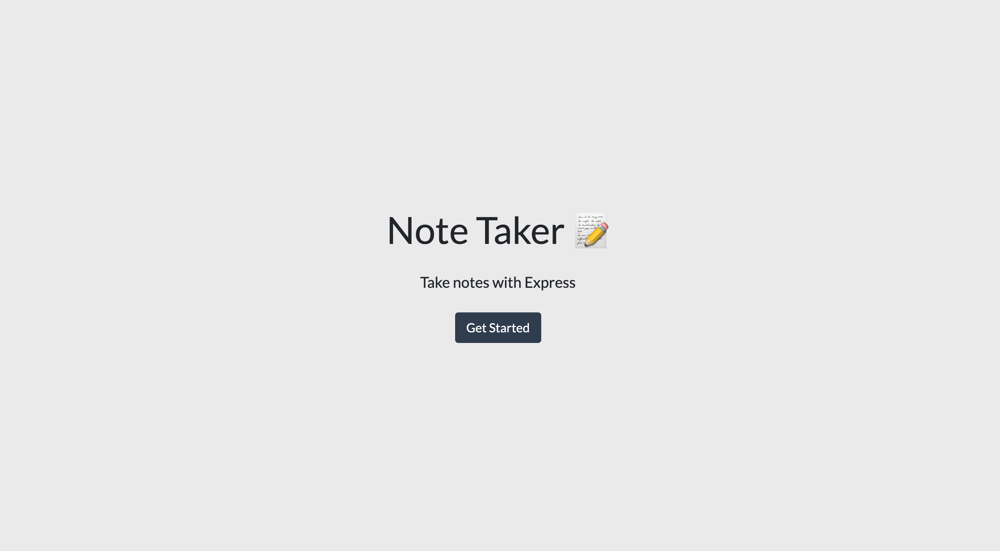
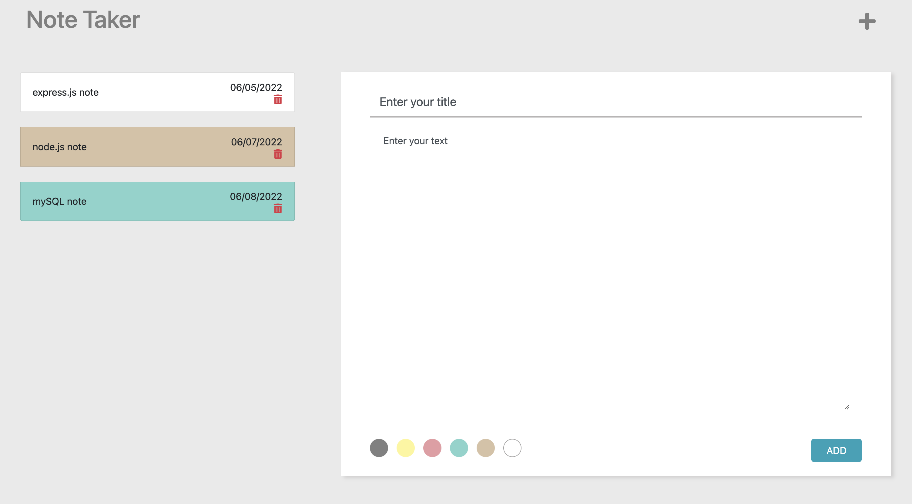

# Note_Taker_App

[](https://opensource.org/licenses/MIT)

## Live link

https://lit-river-01645.herokuapp.com/notes

## Description

Always have many notes need to take for the class, work...etc, sometime just want to quickly paste and save it. So that I want to create a web/APP can save quickly, update and delete. In this project is more harder use routers connect api, also data rewrite or delete. Learned a lot of how to organize api better. Easy to read in Front-end and Back-end.

## Table of Contents

- [Description](#description)
- [Installation](#installation)
- [Usage](#usage)
- [Built_With](#built-with)
- [API_Resources](#api-resources)
- [License](#license)

## Installation

```
 git clone  https://github.com/ollyhite/note_taker_app.git
```

- create a file
- open ternimal and cd the file name you created
- git clone with my repo link(can copy Installation section's first line)
- cd in the note_taker_app file
- enter "npm i" to install the node_module
- enter "npm start" to run the project and link the http://localhost:3001 to start write your notes!

## Usage




## Built With

- Javascript
- Node.js

## API Resources

- npmjs-express
- npmjs-nanoid
- npmjs-moment

## Author Info & Getting Help

- [Pei-Yun Hite's Github Link](https://github.com/ollyhite)
- Send Qquestions or suggestions for changes to the readme_generator_tool project maintainer, [Pei-Yun Hite](mailto:ollyhite8520@gmail.com?subject=[GitHub]%20note_taker_app%20) , for consideration.

## Credits

https://github.com/coding-boot-camp/miniature-eureka

## License

MIT License
Copyright (c) 2022 Pei-Yun Hite
Permission is hereby granted, free of charge, to any person obtaining a copy of this software and associated documentation files (the "Software"), to deal in the Software without restriction, including without limitation the rights to use, copy, modify, merge, publish, distribute, sublicense, and/or sell copies of the Software, and to permit persons to whom the Software is furnished to do so, subject to the following conditions:
The above copyright notice and this permission notice shall be included in all copies or substantial portions of the Software.
THE SOFTWARE IS PROVIDED "AS IS", WITHOUT WARRANTY OF ANY KIND, EXPRESS OR IMPLIED, INCLUDING BUT NOT LIMITED TO THE WARRANTIES OF MERCHANTABILITY, FITNESS FOR A PARTICULAR PURPOSE AND NONINFRINGEMENT. IN NO EVENT SHALL THE AUTHORS OR COPYRIGHT HOLDERS BE LIABLE FOR ANY CLAIM, DAMAGES OR OTHER LIABILITY, WHETHER IN AN ACTION OF CONTRACT, TORT OR OTHERWISE, ARISING FROM, OUT OF OR IN CONNECTION WITH THE SOFTWARE OR THE USE OR OTHER DEALINGS IN THE SOFTWARE.

[https://choosealicense.com/licenses/mit/](https://choosealicense.com/licenses/mit/)
